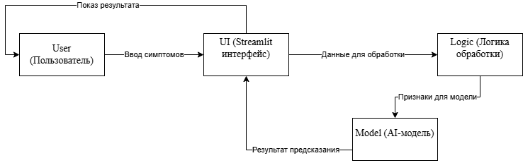

# MedDiognist

## Title
MedDiognist — учебный медицинский помощник

## Description
MedDiognist — это учебный проект, разработанный в рамках университетского курса.  
Проект предназначен для демонстрации архитектуры интеллектуальной системы, которая принимает симптомы от пользователя и возвращает предварительную информацию о возможном диагнозе.

## Tech Stack
В проекте планируется использование следующих технологий:

- Python 3
- Streamlit
- Pandas
- NumPy
- Scikit-learn
- GitHub

## Architecture Diagram



## Project Structure

```
PRIS-2026---MedDiognist/
├── data/
├── docs/
│ └── architecture.png
├── notebooks/
├── src/
│ ├── init.py
│ └── main.py
├── .gitignore
├── README.md
└── requirements.txt
```